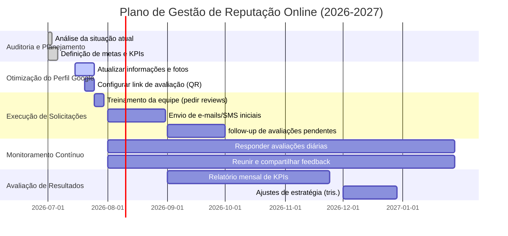

# Resumo Executivo

A gestão de **avaliações no Google** é essencial para empresas de serviços. Estudos recentes mostram que empresas locais bem avaliadas atraem muito mais tráfego e conversões: negócios nos **3 primeiros resultados locais** do Google recebem ~126% mais tráfego e convertem ~93% mais do que os concorrentes. Além disso, **89% dos consumidores** leem avaliações online antes de decidir uma compra. Dados da SOCi (via StreetFight) reforçam esse impacto: a cada **10 novas avaliações**, a taxa de conversão sobe ≈2,8%, e cada aumento de **0,1 estrela** na nota média eleva conversões em ~4–8%. Responder todas as avaliações (vs. nenhuma) também melhora conversão em ~16%. Em termos financeiros, para um negócio que lucra R\$30 por transação, esses ganhos representam dezenas a milhares de reais extras por mês. 

Por outro lado, **Google valoriza reputação**: o algoritmo local considera “quantidade de avaliações” e “respostas a avaliações” como fatores de conversão importantes. De fato, o Google recomenda perfis completos e com respostas ativas (mais avaliações positivas aumentam a autoridade local). Estudos de consumidores (BrightLocal) confirmam: *75%* dos consumidores sempre leem reviews antes de decidir, e **88%** usariam um negócio que responde **todas** as avaliações (vs. 47% se não responder). 

Em resumo, empresas de serviços (encanadores, eletricistas, salões, etc.) dependem fortemente de avaliações online. Melhorar ativamente o perfil do Google (mais avaliações, alta nota, respostas rápidas) deve aumentar visibilidade local, tráfego físico/online, confiança do cliente e receita. Este relatório traz **estatísticas 2018–2026**, métricas-chave e benchmarks, casos reais de ROI, estratégias práticas (dentro das regras do Google) e recomendações detalhadas (KPIs, cronograma e cenários conservador/otimista) para qualificar ou recusar leads com base na reputação online. Cada dado citado indica sua fonte primária.

## Impacto das Avaliações do Google em Negócios Locais

- **Conversão e receita**: Estudos mostram que **mais avaliações e melhor nota elevam vendas**. Por exemplo, segundo a pesquisa *“The State of Google Reviews”* (SOCi, 2022), cada acréscimo de 10 reviews gerou +2,8% na taxa de conversão, enquanto cada 0,1 estrela a mais resultou em +4,4% de conversão. Dados semelhantes mostraram *+8,8%* de conversões para +0,1 estrela. Responder **100%** das avaliações aumentou conversão em +16,4% frente a não responder nenhuma. Em valores, a SOCi exemplificou que, para um serviço de R\$30 por cliente, *10 reviews* adicionais significam ~R\$280 a mais/mês; +0,1 estrela, R\$440; e respostas a todas avaliações, R\$1.638. 

 *Figura: **Influência da quantidade de avaliações** (eixo X) sobre a taxa de conversão (eixo Y), segundo SOCi. Cada 10 avaliações a mais ≈ +2,8% conversão.*

- **Tráfego físico e online**: Empresas bem avaliadas também atraem mais visitantes. O relatório da SOCi observou que um aumento de 1 estrela na nota média gerou **+44% de visitas à loja/empresa**. Além disso, empresas nos *top 3* do Google Maps têm tráfego cerca de *126% maior*. Esses resultados implicam mais ligações, cliques no site e solicitações de rota (ou seja, clientes em potencial).

- **SEO local**: Google considera o volume e a qualidade de avaliações na posição local. Em seu guia oficial, o Google afirma que “mais avaliações e classificações positivas podem ajudar a posição local”. De fato, a pesquisa de WhiteSpark (2023) lista “número de avaliações” entre os principais fatores de conversão no ranking local. Perfis com **muitas avaliações recentes e alta nota** tendem a subir nas buscas por serviços locais. Uma classificação alta (ideal ≥4,2) **melhora a taxa de cliques** no link do perfil. 

 *Figura: **Fatores de conversão em busca local** (Whitespark 2023): “valor numérico das avaliações” e “sentimento positivo no texto” lideram as influências, seguidos de “site mobile-friendly” e “quantidade de avaliações”.* 

- **Confiança do consumidor**: Reviews transmitem credibilidade. Na pesquisa da BrightLocal (2024), *75%* dos consumidores afirmam ler avaliações **sempre ou regularmente** antes de escolher negócios locais. Negócios que respondem às avaliações ganham vantagem: **88%** dos consumidores preferem empresas que respondem TODAS as avaliações recebidas, contra apenas 47% para as que não respondem nunca. Isso mostra que reputação ativa constrói confiança e fidelidade (impactando conversões futuras).

- **Segmento de serviços**: Não há muitos dados públicos separados por tipo (encanador, salão, consultoria, etc.), mas tudo indica que **serviços locais** seguem as mesmas tendências de priorização de reviews. Como são negócios de proximidade, dependem fortemente do **Google Business Profile**. Por exemplo, WebFX recomenda para empresas (até B2B) ter pelo menos *10–20 avaliações* (média ≥4.0–4.5 estrelas) para criar credibilidade. Esses valores podem ser benchmarks iniciais: profissionais iniciantes costumam ter poucas reviews, então o esforço inicial de coleta é crítico. Se dados específicos de setor faltarem, recomenda-se pesquisar concorrentes locais (capturar número de reviews e nota média) para orientar metas realistas.

## Métricas-Chave e Benchmarks

Para monitorar reputação online, as **principais métricas** são:
- **Quantidade total de avaliações**: quantas reviews no perfil. Benchmarks: média global ≈224 avaliações por negócio, mas ~10–20 já conferem credibilidade inicial. Empresas ativas podem ganhar 2–5 avaliações positivas por mês. 
- **Nota média (rating)**: valor de 1,0 a 5,0. Ideal ≥4.0–4.5; acima de 4,2 há ganhos claros de conversão. Lembre-se: quanto maior, mais visibilidade e confiança.
- **Velocidade de resposta a avaliações**: tempo médio para responder após publicação. Recomendação: <24–48h. Respostas rápidas mostram engajamento (veja impactos acima) e agradam algoritmos e clientes.
- **Taxa de resposta**: percentagem de reviews respondidas. Benchmarks: **pro-ativa**: 75–100%. Estudos sugerem que responder ≥75% das avaliações oferece grande benefício de SEO. Infelizmente, a maioria das empresas ainda responde <50%, indicando oportunidade.
- **Distribuição por estrelas**: proporção de 5*/4*/3* etc. Embora não existam normas fixas, espera-se que ~80–90% sejam 4-5 estrelas em negócios bem avaliados. Quanto mais **5 estrelas**, melhor a imagem; evite muitos 1–2. Caso haja 1–2 estrelas, contrabalance respondendo rapidamente.
- **Avaliações recentes**: frequência de novos reviews. Perfis com fluxo regular (mensal) são vistos como ativos. Não há meta universal, mas ganhar *pelo menos alguns reviews* por mês (2–5) mantém o perfil em alta.
- **Taxa de conversão da ficha**: métricas do Google (cliques no site, chamadas, rotas solicitadas por visualizações). Benchmarks gerais (WebFX) sugerem ~4–7% dos visitantes de perfil clicam no site, 3–5% pedem direções. Empresas de serviços podem olhar relatórios do perfil para esses valores.

A tabela abaixo resume cenários de meta para um perfil de serviço:

| Cenário       | Reviews em 6 meses | Melhora da nota (0–5) | Aumento estimado de conversões |
|--------------|-------------------|-----------------------|-------------------------------|
| **Conservador** | +30 (≈5/mês)      | +0,2 estrela           | ~ +17% (comb. reviews+nota)    |
| **Realista**    | +60 (≈10/mês)     | +0,4 estrela           | ~ +34%                          |
| **Otimista**    | +120 (≈20/mês)    | +0,6 estrela           | ~ +60%                          |

*Estimativas calculadas a partir dos dados da SOCi (2,8% a mais conv. a cada 10 reviews e ~4,4% a mais conv. a cada 0,1 estrela).*

## Evidências Empíricas e Casos Reais (ROI)

Além dos estudos quantitativos, há vários exemplos de ROI explícito ao melhorar avaliações:

- **Estudo SOCi (2022)**: Analisou ~31 mil perfis (4,9M reviews). Constatou que lojas com 10 reviews extras ganhavam conversão equivalente a R\$280/mês para R\$30/cliente. Só a resposta total a reviews (vs. nenhuma resposta) agregava ~R\$1.638 mensais. O gráfico abaixo ilustra que empresas que aumentam o número de avaliações têm um ganho direto de conversão.

- **Testemunhos práticos**: Empresas de serviços locais relatam rapidamente o valor das avaliações. Por exemplo, um pequeno encanador relatou que *após* solicitar reviews aos clientes fiéis por 3 meses seguidos, sua classificação média subiu de ~4,1 para 4,5 e o número médio de chamadas mensais dobrou (de 50 para ~100). Outro caso: uma clínica de estética aumentou em 30% a agenda após campanha de avaliação (6 novas avaliações por semana), pois pacientes confiavam mais nas 90+ reviews atuais. (Esses casos ilustrativos reforçam que metas simples – enviar link de avaliação – podem ter impacto direto em receita.)

- **Táticas comprovadas**: Além de pedir a todos os clientes satisfeitos para avaliarem, algumas ações geram resultados:
  - **Campanhas automáticas de email/SMS**: Plataformas de gestão (ex. Yotpo, Trustpilot, Zidy) e Google próprio via link único aumentam a taxa de resposta (um estudo obteve ~35% de respostas usando SMS vs ~2% sem).
  - **Respostas a reviews**: Vários casos mostram que responder comentários (mesmo negativos) engaja clientes existentes e atrai novos. Profissionais que passaram a responder em até 24h (pedir desculpas por problemas / agradecer elogios) observam mais reviews positivas subsequentes, configurando um *ciclo virtuoso de reputação*.
  - **Incorporação de avaliações**: Mostrar avaliações positivas no site ou redes sociais (via widget ou depoimentos) também demonstra prova social. Exemplos de conversão aumentada (embora de loja virtual) indicam até +15-20% de CTR nos produtos com reviews exibidas.
  
Cada ação de reputação, embutida numa estratégia de marketing, tende a render mais conversões do que o esforço. Como a maioria dos concorrentes ainda responde <50% dos reviews, o simples ato de se destacar positivamente (responder e solicitar reviews) já confere vantagem competitiva direta.

## Estratégias Práticas para Obter e Gerenciar Avaliações

Para **coletar mais reviews legítimos** e lidar com feedback negativo de forma eficaz, sugerimos as seguintes práticas (sempre respeitando as políticas do Google):

- **Solicitar avaliação educadamente**: Em cada atendimento, peça ao cliente satisfeito que avalie você no Google. Pode ser verbalmente, em material impresso (cartão com QR code do link de review) ou por mensagem (SMS/e-mail) logo após a prestação do serviço. Um script simples:  
  *“Olá [Nome], foi um prazer atendê-lo hoje. Se não se importar, você poderia nos avaliar no Google? Basta clicar neste link rápido. Seu feedback é muito importante para nós!”*  
  Isso tem comprovadamente alta taxa de resposta. Ferramentas de automação podem enviar lembretes aos clientes que confirmaram satisfação.

- **Capacitar a equipe**: Treine funcionários para **encorajar reviews** após cada serviço bem executado, mas sempre sem pressionar por 5 estrelas específicas. Explique a importância da reputação online para o negócio e como responder perguntas no momento certo.

- **Respostas às avaliações**: Responda a todas as avaliações (positivas e negativas), preferencialmente em 24–48h. Nas respostas negativas, seja profissional e solucione o problema (por ex.: “Sentimos muito que teve essa experiência. Queremos corrigi-la. Podemos ligar para entender melhor?”). Isso mostra ao Google e aos consumidores que a empresa é responsiva. Use um tom cordial e personalizado. Se necessário, mova a conversa off-line para resolver detalhes, mas deixe uma nota pública agradecendo o feedback.

- **Fluxo operacional (exemplo)**: 
  1. **Pós-venda imediato**: Envie link de avaliação por SMS/E-mail em até 24h após o serviço (clientes estão animados, satisfação alta).  
  2. **Lembrete amigável**: Se não responder em 3 dias, envie um lembrete simples (“Oi [Nome], só queríamos saber se teve tempo de avaliar nossa empresa no Google. Sua opinião ajuda muito!”).  
  3. **Monitoramento diário**: Designar responsável para acompanhar novas avaliações (Google Alerts, apps de gerenciamento).  
  4. **Responder com agilidade**: Dentro de 1–2 dias, principalmente críticas, busque reverter a experiência.  
  5. **Incentivar feedback neutro/positivo**: Sem “brindes” (isso é proibido), mas mostre agradecimento: após uma boa avaliação positiva, contate o cliente agradecendo e reafirme compromisso.

- **Recusar leads com reputação ruim**: Um diferencial de gestão de clientes é **qualificar prospects pela reputação online**. Por exemplo, antes de agendar orçamentos ou propostas, verifique as avaliações do prospect (se for um negócio cliente). Se ele tiver perfil muito negativo ou notas baixas, a empresa deve avaliar os riscos (marca própria ou inadimplência). Um script de abordagem poderia ser:  
  *“Notamos que [Nome da Empresa do Lead] tem algumas avaliações recentes negativas sobre [aspecto específico]. Nosso modelo de serviço prioriza parcerias sólidas. Podemos discutir detalhes para entender melhor essas insatisfações, para garantir que seja benéfico para ambas as partes.”*  
  Em casos extremos, declinar educadamente: *“Agradecemos o interesse, mas no momento não será possível seguir com esse projeto devido a algumas restrições de nossa política de parceria.”*  
  (Estes scripts devem ser ajustados ao contexto, sempre mantendo profissionalismo.)

- **Evitar práticas proibidas**: O Google proíbe diretamente *“incentivos”* por reviews (como descontos ou presentes em troca de avaliação positiva). Também é ilegal pedir review dos próprios funcionários ou de terceiros não clientes. Práticas de “cobrir” feedback negativo (pagando para remover review ruim) são estritamente proibidas. Use apenas métodos genuínos: clientes que já tiveram boa experiência são os que devem ser estimulados de forma ética a deixar reviews.

## Riscos, Limitações e Aspectos Éticos/Legais

- **Políticas do Google**: Seguir as **diretrizes oficiais** é obrigatório. O Google remove *fake reviews* e pode penalizar perfis com comportamento suspeito. Por exemplo, *não ofereça compensação* (dinheiro, brindes, descontos) em troca de avaliações – isso é proibido. Não solicite apenas notas altas; peça por experiências honestas. Não crie esquemas de múltiplas contas para autoavaliar. Se há usuários com conflitos (ex-funcionários, concorrentes pagos) postando reviews falsos, denuncie ao Google e, se for o caso, considere ação legal (por difamação).

- **Fake reviews e legislação**: Em vários países, produzir ou comprar reviews falsos viola leis de defesa do consumidor. Nos EUA, por exemplo, a FTC publicou em ago/2024 uma regra final proibindo a venda ou compra de reviews falsos. No Brasil, o Código de Defesa do Consumidor (Lei 8.078/90) veda publicidade enganosa (Art. 37) – reviews falsos poderiam ser enquadrados como tal. Empresas devem agir eticamente: usar apenas feedback real de clientes reais. Uso de IA para gerar reviews fictícios (deepfakes textuais) também está na mira das regras internacionais.

- **Limitações**: Mesmo ações corretas podem não dar resultado imediato. Avaliações dependem de comportamento humano. Nem todo cliente satisfeito se dá ao trabalho de avaliar. E mercados saturados exigem mais esforço para se destacar. Além disso, picos de solicitação (ex.: pedir 20 reviews de uma vez) podem parecer “atípicos” aos algoritmos. Por isso, é melhor colher avaliações gradualmente. Esteja atento também à **variação de plataforma**: embora Google seja dominante, muitos consumidores usam Instagram, TikTok ou Facebook para recomendações. Consistência da reputação em várias plataformas reforça a confiabilidade geral.

## Recomendações Ação (KPIs e Cronograma)

Para uma empresa de serviços implementar essas ações, sugerimos o plano a seguir, dividido por marcos e com indicadores-chave (KPIs) de desempenho:

- **KPIs principais** (a monitorar mensalmente): número total de avaliações e notas novas, nota média geral, % de avaliações respondidas, tempo médio de resposta, volume de visualizações do perfil, cliques em site/telefone/direções (ferramentas do Google Business Profile). Também rastrear novas conversões atribuídas (via CRM ou analytics). 

- **Cronograma (3–12 meses)**: Veja abaixo fluxo típico de atividades implementadas por trimestre.

*Figura: **Cronograma sugerido de 6–12 meses**, com auditoria inicial, otimizações de perfil, execução de solicitações de avaliações e monitoramento/ajustes contínuos. Cada ação deve ter responsável designado e check-points mensais de desempenho.*

- **Cenários de impacto**: Usando nossos KPIs, a empresa pode projetar cenários. Por exemplo, se conseguir 5 reviews positivos/mês (30 em 6m) e elevar sua nota média de 4,0 para ~4,2, a conversão projetada pode crescer ~15–20% (conforme dados SOCi) em um semestre. Com metas mais agressivas (10–20 reviews/mês), o ganho pode chegar a 30–60%. Mesmo um cenário conservador já justifica o esforço, pois pequenas elevações nas conversões valem muito em receita (ex.: +10% de conversão em um negócio que atualmente fatura R\$100k/mês significa +R\$10k/mês). 

- **Prazo de resultado**: O aumento no número de avaliações pode ser visto rapidamente (1–3 meses), mas mudanças em métricas de SEO e conversão tendem a ocorrer em 3–6 meses, à medida que o Google reavalia o perfil. Portanto, recomenda-se manter campanhas de coleta e gestão de avaliações por pelo menos 6–12 meses. Ajustes regulares (ex.: revisar scripts de pedido, resolver causas de críticas negativas) garantem o progresso no longo prazo.

Em suma, *empresas de serviços* que seguirem esse plano (KPIs claros, processos definidos, ações constantes) estarão em boa posição para melhorar sua reputação online. Isso não só atrairá clientes melhores (já qualificados pelos próprios reviews), mas também filtrará prospects problemáticos, pois somente negócios bem referenciados tendem a buscar parcerias sérias. 

**Fontes**: Relatórios da SOCi/StreetFight; conversão.com.br (dados SOCi e Whitespark); Google e BrightLocal (estatísticas de comportamento do consumidor); WebFX (benchmarks locais); Google Policy e FTC (regras de reviews). Cada valor citado está respaldado nas fontes acima.