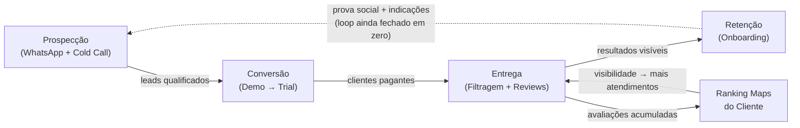
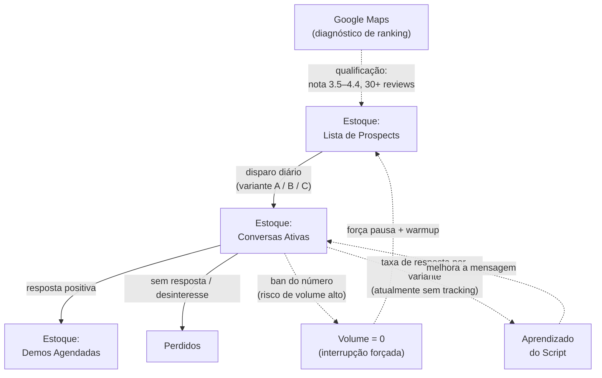
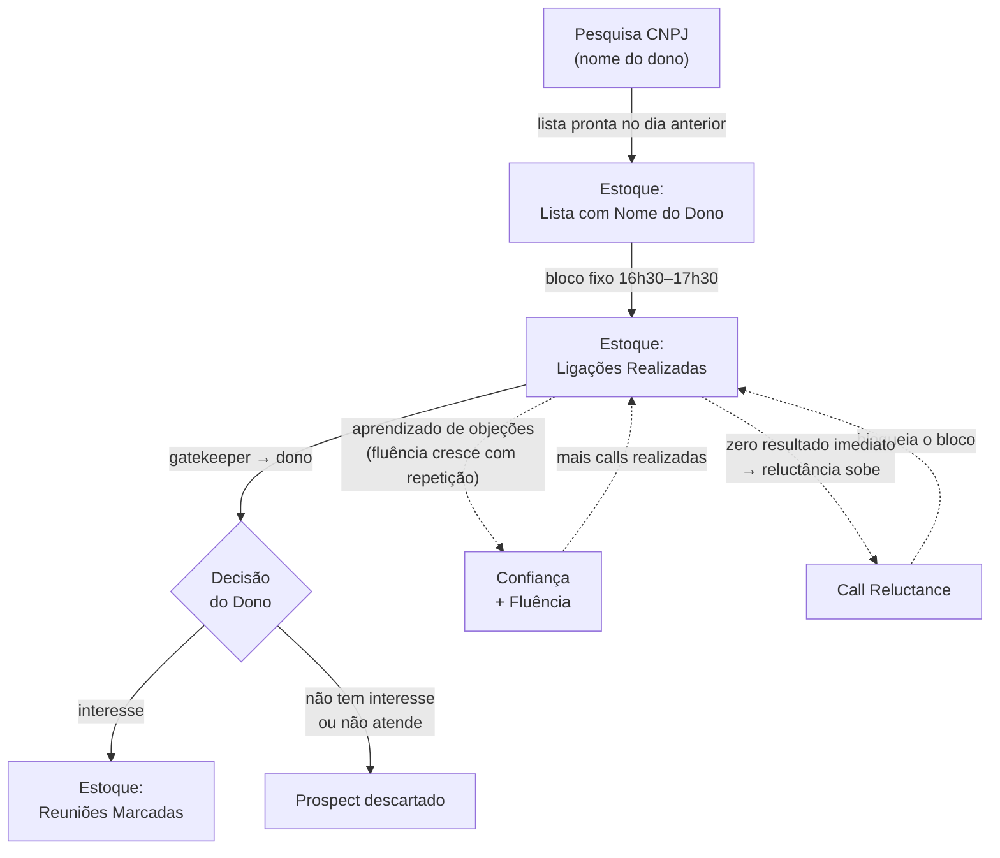
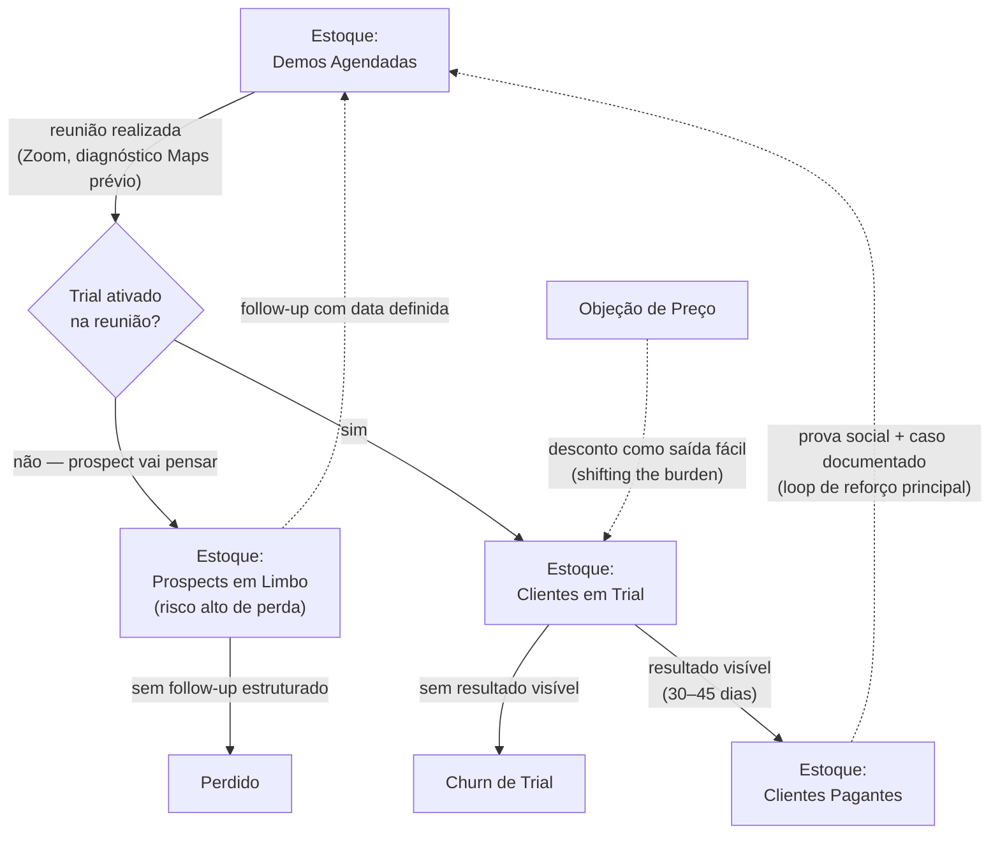
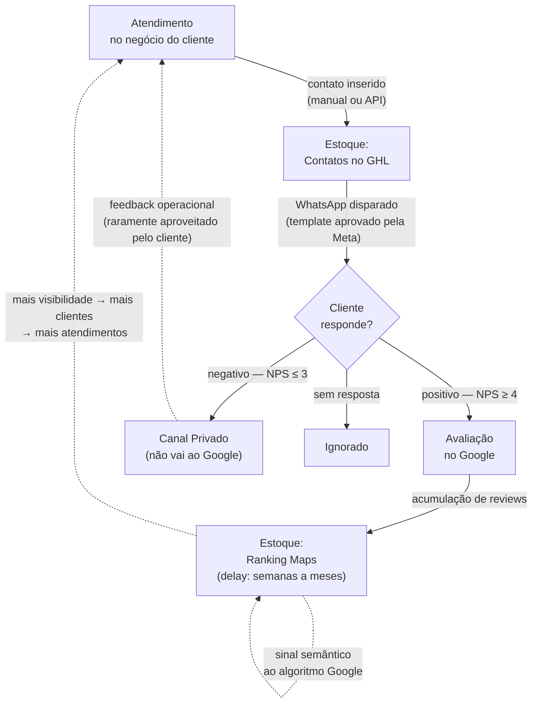
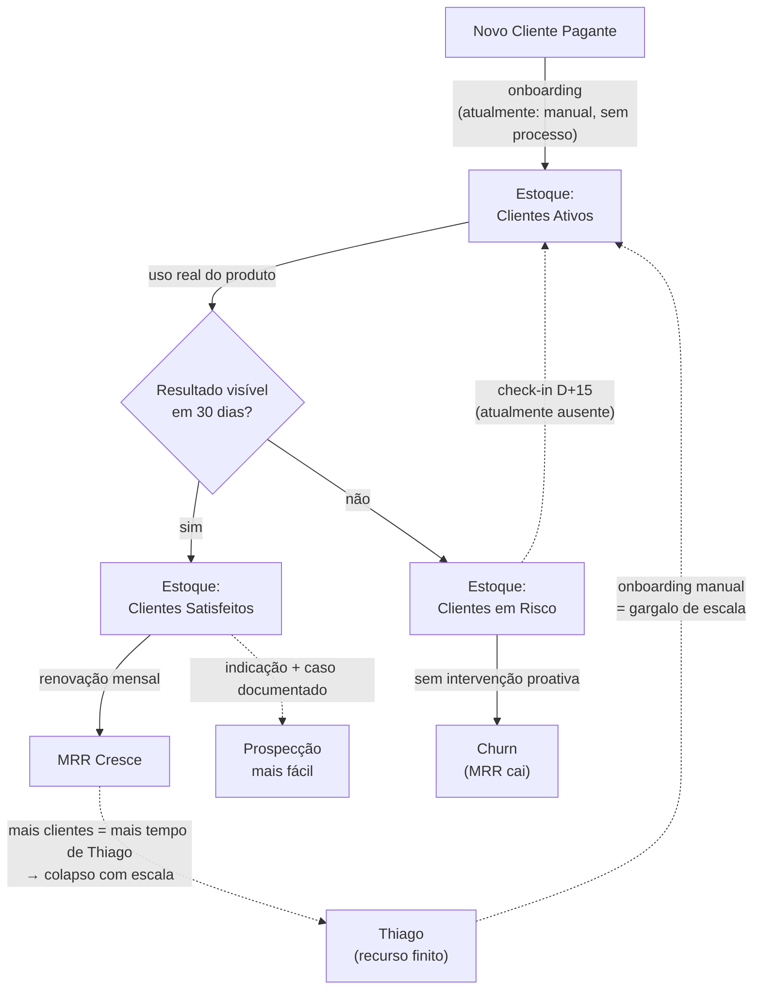

---
title: "Thinking in Systems — Mapa dos Processos da Avalyse"
type: analysis
tags: [sistemas, avalyse, thinking-in-systems, processos, alavancagem, meadows]
created: 2026-06-19
updated: 2026-06-19
sources: 11
---

Aplicação do framework de [[pensamento-sistemico]] ([[donella-meadows]]) aos cinco processos centrais da [[Avalyse]]. Cada processo é mapeado com estoques, fluxos, loops de retroalimentação, arquétipos de risco e intervenções nos pontos de alavancagem identificados.

---

## Sistema Macro

Antes de analisar cada processo individualmente, a Avalyse como um todo é um sistema com cinco subsistemas interdependentes. O comportamento de cada um afeta os demais — e o loop mais importante é o que ainda não existe: **resultado visível do cliente → prova social → mais demos**.

**Diagnóstico macro:** o loop de reforço principal (resultado do cliente → prova social → facilita próxima venda) ainda não está ativo — não há um primeiro cliente com resultado documentado. Todos os outros processos operam sem esse combustível. Isso explica por que o esforço de prospecção precisa ser desproporcionalmente alto para gerar cada demo.

---

## Processo 1 — Cold Outreach WhatsApp (V3)

Funil de aquisição digital. Fluxo colapsado: diagnóstico + pitch em uma mensagem, três variantes (A/B/C), CTA direto para trial. Dado real: ~400 msgs → 1 reunião marcada (~0,25% meeting rate, n ainda pequeno para conclusão).

**Estoques**
- Lista de prospects qualificados (entrada principal do sistema)
- Conversas ativas (mensagens enviadas aguardando resposta)
- Demos agendadas

**Fluxos**
- Pesquisa Maps → qualificação → Lista
- Disparo diário → Conversas ativas
- Resposta positiva → Demo agendada; resposta negativa/sem resposta → prospect perdido
- Volume alto → risco de ban → interrupção forçada do fluxo

**Loops**
- **Reforçador (fraco, não fechado):** mais respostas → mais dados sobre o que funciona → script melhor → mais respostas. Está quebrado porque não há tracking por variante — o aprendizado não se acumula.
- **Balanceador (oscilação):** volume alto → número banido → pausa forçada → recomeço. Causa oscilação no fluxo de entrada de demos.

**Arquétipos em risco**
- **Rule beating:** prospects respondem vagamente ("vou pensar", "manda mais infos") sem intenção real de converter — obedecem a letra da conversa sem o espírito.
- **Drift to low performance:** se a taxa de resposta cai, pode haver tendência inconsciente de baixar o padrão de qualificação da lista (aceitar notas fora do critério ideal, menos reviews).
- **Shifting the burden:** usar só WhatsApp para evitar cold call, que exige mais esforço mas tende a ter maior taxa de conversão por contato.

**Pontos de alavancagem**
| # Meadows | Tipo | Aplicação |
|---|---|---|
| #7 | Information flow | Qualidade do diagnóstico Maps como critério de entrada na lista |
| #8 | Rules | Critérios de qualificação obrigatórios não negociáveis (nota 3.5–4.4, 30+ reviews, celular visível) |
| #6 | Reinforcing loop | Velocidade de aprendizado do script via tracking de resultado por variante |
| #1 | Parameters | Volume diário mínimo garantido (piso, não teto) |

**Intervenções**
1. **Fechar o loop de aprendizado:** adicionar coluna na planilha de pipeline com variante enviada (A/B/C) e resultado (resposta positiva / enrolando / sem resposta). Sem isso, o sistema não aprende e o script não melhora.
2. **Tornar critérios de lista rígidos:** prospect que não atende aos 3 critérios (nota, reviews, celular visível) não entra na lista — impede drift silencioso de qualidade.
3. **Protocolo anti-ban explícito:** definir volume máximo diário por número + rotação de números para não zerar o estoque de conversas ativas.

---

## Processo 2 — Cold Call (V3)

Funil de aquisição por voz. Vantagem técnica: CEP → CNPJ → nome do dono (~90% de precisão na abertura). Objetivo único: reunião de 10 min no Zoom. Rampa definida: 3 → 5 → 8 → 15 calls/dia em 4 semanas.

**Estoques**
- Lista de prospects com nome do dono (via CNPJ)
- Ligações realizadas no bloco diário
- Reuniões marcadas

**Fluxos**
- Pesquisa CNPJ → nome do dono → Lista
- Bloco diário → ligações → gatekeeper → dono → decisão
- Decisão positiva → reunião marcada
- Sem resultado imediato → call reluctance → menos calls

**Loops**
- **Reforçador virtuoso:** mais calls → aprendizado de objeções → mais fluência → mais calls (confiança cresce com repetição). É o loop que a rampa de 4 semanas está tentando construir.
- **Reforçador vicioso:** sem resultado imediato → ansiedade → menos calls → menos resultado → mais ansiedade. É o loop que destrói a maioria dos processos de cold call antes de atingir fluência.
- **Balanceador intencional:** rampa semanal (3→5→8→15) funciona como delay controlado que impede o sistema de explodir antes de o loop virtuoso estar ativo.

**Arquétipos em risco**
- **Shifting the burden:** usar WhatsApp como substituto (mais confortável) em vez de complemento da cold call.
- **Drift to low performance:** meta diária de calls cai silenciosamente quando o resultado tarda — "hoje foi um dia corrido" vira padrão estrutural.
- **Escalation (interno):** ansiedade de resultado → mais pressão interna → pior execução → mais ansiedade — loop de reforço vicioso puramente interno.

**Pontos de alavancagem**
| # Meadows | Tipo | Aplicação |
|---|---|---|
| #7 | Information flow | Nome do dono via CNPJ — muda o fluxo do gatekeeper inteiro |
| #8 | Rules | Bloco fixo 16h30–17h30 inegociável — não depende de motivação no dia |
| #5 | Balancing loop | Tracking visível de calls/dia vs. meta (fecha o loop de auto-responsabilidade) |
| #11 | Paradigm | Identidade de "fundador que vende" vs. "dev que precisa vender" |

**Intervenções**
1. **Tornar o tracking público para si mesmo:** número de calls do dia escrito fisicamente ou aberto na tela durante o bloco. Dado visível fecha o loop de responsabilidade (#7).
2. **Role-play de 10 min antes de cada bloco:** simular as 3 objeções mais comuns usando calibrated questions de [[chris-voss]] — entra no estado correto antes da primeira ligação.
3. **Separar pesquisa CNPJ (manhã) de ligações (tarde):** elimina resíduo de atenção entre tarefas distintas. Bloco de calls começa com lista pronta.
4. **Antídoto para drift:** meta da semana só pode ser reduzida se a taxa de conversão estiver *acima* da semana anterior — regra que impede queda sem evidência real.

---

## Processo 3 — Demo / Reunião de Vendas

O processo de conversão central. Estrutura: 7 blocos (abertura → diagnóstico → pitch → prova social → preços → integração → fechamento). Mapa de objeções existente. Dado real: primeira demo agendada para 2026-06-23.

**Estoques**
- Demos agendadas
- Prospects em limbo pós-demo (não converteram na reunião)
- Clientes em trial
- Clientes pagantes

**Fluxos**
- Demo → trial ativado na reunião (ideal) ou prospect em limbo (risco)
- Trial → resultado visível → pagamento
- Trial sem resultado → churn
- Objeção de preço → negociação → fechamento ou perda

**Loops**
- **Reforçador principal (ainda fechado em zero):** trial com resultado → pagamento → caso real com dados → próxima demo mais fácil (prova social). Esse loop só se fecha com o primeiro cliente ativo com resultado documentado.
- **Balanceador perigoso:** preço levanta objeção → desconto fecha → MRR menor → sinaliza que o preço é negociável → próximas demos têm mais objeção de preço.
- **Balanceador ausente:** sem tracking de taxa demo→trial, o processo não recebe feedback da própria performance — melhoria por intuição, não por dado.

**Arquétipos em risco**
- **Seeking wrong goal:** otimizar para "demo bem executada" (sensação de controle) em vez de "trial ativado na reunião" (resultado do sistema).
- **Shifting the burden:** oferecer desconto, período de trial maior ou "pensa e me fala" em vez de fortalecer o argumento de valor no momento da objeção.
- **Drift to low performance:** cada demo que não converte pode reduzir sutilmente a autoconfiança → pitch mais hesitante → menor conversão — loop vicioso silencioso.

**Pontos de alavancagem**
| # Meadows | Tipo | Aplicação |
|---|---|---|
| #10 | Goals | Métrica-norte = trials ativados/semana, não demos realizadas/semana |
| #8 | Rules | Regra: nunca encerrar a reunião sem trial ativado *ou* próximo passo com data e hora marcadas |
| #7 | Information flow | Diagnóstico Maps feito *antes* da demo, usado como evidência concreta na abertura |
| #6 | Reinforcing loop | Gravar demos (com permissão) para loop de aprendizado entre reuniões |

**Intervenções**
1. **Checklist de 3 perguntas no final de toda demo:** (1) trial foi ativado? (2) se não, qual foi a objeção real? (3) qual é o próximo passo com data e hora? — esse ritual fecha o loop de aprendizado que hoje não existe.
2. **Nunca introduzir preço antes de o valor estar estabelecido:** usar o diagnóstico Maps como prova concreta antes de mencionar R$397 — o dado contextualiza o preço em vez de expô-lo nu.
3. **Protocolo anti-desconto:** se houver objeção de preço, usar calibrated question ([[negociacao-voss]]: "O que tornaria esse investimento óbvio pra você?") antes de qualquer negociação de número.
4. **Ativar o trial durante a reunião, não depois:** a integração GHL deve ser feita na call. O prospect que sai "pra pensar" raramente volta — o limbo é um estoque com alta taxa de saída.

---

## Processo 4 — Entrega do Produto

O sistema central de criação de valor para o cliente. Coleta de contatos pós-atendimento → disparo de WhatsApp → filtragem (positivo ao Google, negativo a canal privado) → avaliações → ranking Maps.

**Estoques**
- Contatos de clientes cadastrados no GHL (subconta do cliente)
- Avaliações acumuladas no perfil Google do cliente
- Ranking do cliente no Maps (estoque lento — muda em semanas/meses)
- Reputação percebida publicamente pelo consumidor final

**Fluxos**
- Atendimento → contato inserido → WhatsApp disparado → avaliação (positiva / negativa / sem resposta)
- Avaliações positivas → perfil Google → ranking sobe (com delay)
- Ranking sobe → mais visibilidade → mais clientes → mais atendimentos (loop de reforço do negócio do cliente)

**Loops**
- **Reforçador benéfico:** mais avaliações → ranking sobe → mais visibilidade → mais clientes → mais atendimentos → mais avaliações. É o produto central que a Avalyse vende — a entrega de valor está aqui.
- **Reforçador problemático:** filtragem reduz sinal semântico ao Google → Google percebe padrão anômalo → pode banir avaliações ou penalizar o perfil → cliente perde reviews acumulados. Loop de destruição lento mas potencialmente irreversível.
- **Balanceador ausente:** não há feedback loop formal entre resultado do cliente (ranking, novos clientes) e revisão do processo de entrega. O sistema opera sem retorno.

**Arquétipos em risco**
- **Rule beating:** filtragem de avaliações obedece a letra das solicitações do cliente (mais 5★) mas viola o espírito das políticas do Google ([[filtragem-de-avaliacoes]] = review gating). O sistema parece funcionar até ser penalizado.
- **Seeking wrong goal:** maximizar avaliações 5★ visíveis em vez de maximizar resultado real do negócio do cliente (mais clientes via ranking, mais receita).
- **Shifting the burden:** filtragem como solução que evita o trabalho mais difícil — ajudar o cliente a melhorar a experiência real para que avaliações negativas diminuam organicamente.

**Delays críticos**
Rankings no Maps levam semanas a meses para refletir novos reviews. Cria risco de "overshoot" nas expectativas: o cliente espera resultado em D+7, o sistema entrega em D+45. Sem comunicação proativa desse delay, o churn acontece antes do resultado ser visível.

**Pontos de alavancagem**
| # Meadows | Tipo | Aplicação |
|---|---|---|
| #7 | Information flow | Relatório mensal de resultados (posição antes/depois, reviews geradas) — fecha o loop com o cliente |
| #9 | Self-organization | Página web de entrada de contatos — elimina dependência do modo manual e é pré-requisito para escala |
| #4 | Delays | Comunicar o delay de ranking no onboarding — gestão de expectativa é leverage, não só educação |
| #8 | Rules | Critério mínimo de qualificação: cliente precisa ter fluxo real de atendimentos para o produto funcionar |

**Intervenções**
1. **Relatório mensal automatizado para o cliente:** posição no Maps antes/depois + número de reviews geradas no mês. É o produto real que o cliente está comprando — torná-lo visível fecha o loop de valor e reduz churn por delay.
2. **Script de expectativa no onboarding:** "As primeiras avaliações chegam em X dias. O ranking começa a se mover em Y semanas. No dia Z você recebe o primeiro relatório." — elimina churn por expectativa não gerenciada.
3. **Reduzir dependência da filtragem:** priorizar clientes com alto volume de atendimentos (mais reviews reais geradas) em vez de depender da filtragem para compensar baixo volume — sistema mais robusto e fora do risco de penalização.
4. **Construir a página web de entrada de contatos:** é o desbloqueador técnico que elimina o gargalo manual e é pré-requisito para qualquer escala além do primeiro cliente.

---

## Processo 5 — Retenção / Onboarding

O processo menos desenvolvido da Avalyse, com uma restrição estrutural importante: o plano atual do [[GoHighLevel]] suporta **3 subcontas** (1 reservada para uso próprio = **máximo de 2 clientes simultâneos**). O upgrade para o plano com subcontas ilimitadas custa ~R$1.500/mês — justificável apenas após 2 clientes pagantes e estáveis. Isso define um **teto de capacidade planejado**, não uma falha: o Stair Step ([[stair-step-method]]) se aplica aqui. Fase atual = onboarding manual até 2 clientes → gatilho de upgrade ao atingir o teto → automação e escala.

Onboarding automatizado não é prioridade agora. O que importa é que os 2 primeiros clientes tenham resultado documentado — esse é o combustível para o upgrade fazer sentido economicamente.

**Estoques**
- Clientes ativos (pagando)
- Clientes satisfeitos (resultado visível em 30 dias)
- Clientes em risco (sem resultado nos primeiros 30 dias)
- MRR

**Fluxos**
- Novo cliente → onboarding → uso ativo → resultado → renovação
- Onboarding deficiente → uso passivo → sem resultado → churn
- Churn → MRR cai → pressão para compensar com mais aquisição (loop vicioso que aumenta carga no topo do funil)

**Loops**
- **Reforçador virtuoso:** resultado visível → satisfação → renovação → indicação → MRR cresce → mais credibilidade nas próximas demos. É o loop mais valioso do sistema — e ainda não está ativo.
- **Balanceador estrutural (intencional):** plano GHL atual → teto de 2 clientes simultâneos → força upgrade ao atingir o teto. Não é bug — é o gatilho de transição de fase. O teto de capacidade é um buffer que impede o colapso de qualidade antes de a automação estar pronta.
- **Balanceador ausente:** sem check-in regular = sem feedback de saúde do cliente = sem possibilidade de intervenção antes do churn. O sistema não tem sinal de alerta durante a fase manual.

**Arquétipos em risco**
- **Drift to low performance:** sem métrica de saúde do cliente definida, o padrão de "cliente bem-sucedido" cai silenciosamente — um cliente sem resultado pode ficar semanas sem ser identificado.
- **Seeking wrong goal (pós-upgrade):** quando escalar, o risco é otimizar para número de clientes ativos em vez de clientes com resultado documentado. A escala só tem valor se o loop de retenção estiver fechado.
- ~~Shifting the burden~~ *Não aplicável agora:* onboarding manual em 2 clientes é gerenciável e deliberado. O arquétipo se torna relevante *após* o upgrade GHL, se a automação não for construída antes da escala.

**Pontos de alavancagem**
| # Meadows | Tipo | Aplicação |
|---|---|---|
| #7 | Information flow | Check-in D+15 e D+30 proativo (perguntar resultado, não esperar reclamação) |
| #10 | Goals | Métrica de retenção = "cliente com resultado visível em 30 dias", não MRR |
| #8 | Rules | Regra: cliente só é considerado "ativo" após primeiro resultado documentado |
| #2 | Buffers | Teto de 2 clientes no plano atual = buffer de qualidade intencional; upgrade é gatilho, não bloqueio |

**Intervenções (fase atual — até 2 clientes)**
1. **Definir "resultado" antes de onboar o primeiro cliente:** ex. "5 avaliações geradas em 30 dias". Sem definição operacional, não há como medir, intervir ou usar como prova social nas próximas demos.
2. **Sequência mínima de onboarding manual (3 pontos de contato):** D+0 (boas-vindas + próximo passo concreto), D+15 (check-in de resultado parcial), D+30 (relatório de resultados). Simples o suficiente para ser sustentável em 2 clientes.
3. **Critério de ativação:** verificar que o cliente tem fluxo real de atendimentos *antes* de ativar. Cliente sem atendimentos não gera reviews — o produto não entrega valor e o churn é certo.

**Gatilho de transição para fase de escala:** ao fechar o 2º cliente pagante, avaliar upgrade do GHL (~R$1.500/mês). Nesse ponto o MRR cobre o custo (~R$794 de 2 clientes vs. R$1.500 do plano — ainda no negativo, então o gatilho real é MRR ≥ R$1.500, ou seja, ~4 clientes, que requer avaliação de quando expandir o plano).

---

## Síntese — Os 3 Pontos de Alavancagem Mais Altos do Sistema Completo

[[donella-meadows]] coloca os pontos mais poderosos de alavancagem não nos parâmetros ou nos fluxos, mas nas **metas do sistema** (#10), na **auto-organização** (#9) e nos **paradigmas** (#11). Aplicado à Avalyse:

### Alavancagem #1 — Fechar o loop de prova social (#6 + #10)

O sistema inteiro opera sem o combustível principal: um primeiro cliente com resultado documentado. Nenhum investimento em script, volume ou pitch vai substituir isso. Enquanto esse loop estiver fechado em zero, cada venda recomeça do zero em termos de credibilidade.

**Caminho:** fechar as reuniões já marcadas como clientes pagantes reais, entregar resultado mensurável (posição no Maps + reviews geradas em 30 dias), e documentar o caso. Oferecer acesso gratuito "para construir prova social" está fora do escopo — a estratégia correta é posicionamento de confiança, não demonstração de insegurança. A prova social legítima vem de um pagante real com resultado real.

**Meta operacional imediata:** primeiro caso documentado com dado concreto ("negócio X saiu de posição Y para Z em 30 dias, gerou N avaliações"). Esse é o único ativo que muda o sistema.

### Alavancagem #2 — Crescimento em estágios definidos pela estrutura do GHL (#2 + #9)

A restrição do plano GHL (3 subcontas = 2 clientes max) não é um obstáculo — é um **buffer de qualidade intencional**. Meadows: *"You can often stabilize a system by increasing the capacity of a buffer. But if a buffer is too big, the system gets inflexible."* O teto de 2 clientes força entrega de qualidade antes de escalar.

**Estágios:**
- **Agora:** fechar 1–2 clientes, onboarding 100% manual, resultado documentado
- **Gatilho de upgrade:** MRR ≥ R$1.500/mês (cobertura do plano avançado GHL) → automação de onboarding → escala

A construção do onboarding automatizado antes desse gatilho seria investimento prematuro — tempo e dinheiro gastos antes de o sistema ter demanda que justifique o custo.

### Alavancagem #3 — Tracking como loop de informação (#7)

Os processos de prospecção e vendas estão operando cegos: sem taxa de resposta por variante, sem taxa demo→trial, sem taxa trial→pagamento. Sem dados, nenhum loop de aprendizado se fecha — a melhoria é por intuição, não por evidência.

Um rastreamento mínimo de 5 colunas na planilha (canal, variante, resultado, objeção, próximo passo) vale mais que qualquer refinamento de script feito sem dados. Como Meadows escreve: *"Most of what goes wrong in systems goes wrong because of biased, late, or missing information."*

---

*Fontes: [[sources/thinking-in-systems-meadows-howtoes]], [[sources/book-review-thinking-in-systems-ram-sevak]] (Ram Sevak, 2025-01-12),[[avalyse-contexto-produto]]], [[sources/avalyse-scripts-cold-outreach-v1]],[[estrutura-cold-call-v3]]], [[sources/avalyse-demo-meeting-script-v1]], [[sources/whitespark-local-ranking-factors-2026]]*
